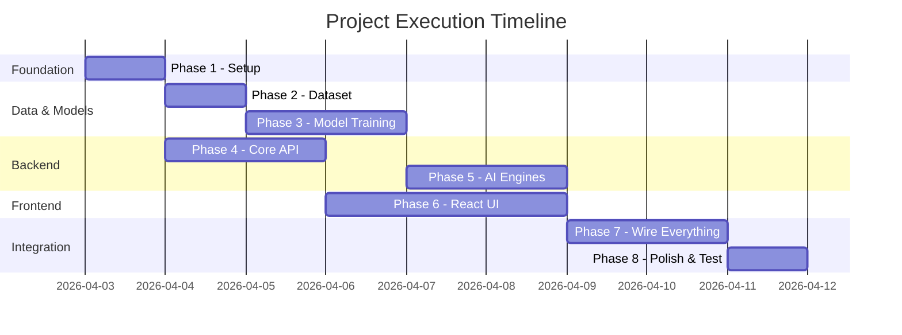
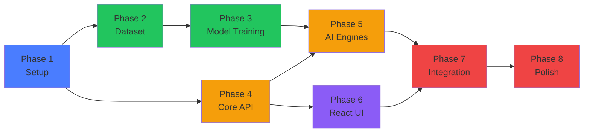

# AI Financial Decision System — Execution Roadmap

## Overview

---

## Phase 1: Foundation Setup
**Goal**: Get both backend and frontend running with empty shells

| Task | Detail |
|------|--------|
| Create `backend/` folder structure | `app/`, `models/`, `routes/`, `engine/`, `schemas/` |
| Create `requirements.txt` | All Python dependencies |
| Create `.env` | `SECRET_KEY`, `GEMINI_API_KEY` |
| Create `app/config.py` | Load env vars, DB path, model paths |
| Create `app/database.py` | SQLAlchemy engine + SQLite3, `Base`, `get_db()` |
| Create SQLAlchemy models | `User`, `FinancialProfile`, `Transaction`, `Goal` |
| Create `app/main.py` | FastAPI app with CORS, include routers |
| Init React app | `npx create-vite frontend --template react` |
| Install frontend deps | `axios`, `react-router-dom`, `chart.js`, `react-chartjs-2` |
| Verify | FastAPI at `localhost:8000/docs`, React at `localhost:5173` |

> **✅ Milestone**: Both servers start without errors

---

## Phase 2: Dataset Generation
**Goal**: Generate 1 lakh+ training dataset

| Task | Detail |
|------|--------|
| Create `data/generate_dataset.py` | Realistic distributions (lognormal income, beta credit scores) |
| Download real Kaggle datasets | German Credit, Credit Card Customers, Lending Club |
| Map & merge real data | Normalize columns to our 8 features |
| Generate synthetic augmentation | Fill to 100,000+ total records |
| Calculate labels | risk_level, budget_stability, savings_ratio, debt_ratio |
| Save CSV | `data/financial_profiles.csv` |
| Verify | Check row count, distributions, no nulls |

> **✅ Milestone**: `financial_profiles.csv` with 100K+ rows, all 8 features + 4 labels

---

## Phase 3: Model Training
**Goal**: Train and save all 4 ML models

**Depends on**: Phase 2 (dataset)

| # | Model | Framework | Input → Output |
|---|-------|-----------|----------------|
| 1 | **Risk Predictor** | TensorFlow (ReLU) | 8 features → risk_level + stability + ratios |
| 2 | **Anomaly (Isolation Forest)** | scikit-learn | spending patterns → anomaly scores |
| 3 | **Anomaly (Autoencoder)** | TensorFlow | spending → reconstruction error |
| 4 | **Spending Forecast (XGBoost)** | xgboost | features → category spending |
| 5 | **Spending Forecast (Prophet)** | prophet | time series → future spending |

| Task | Detail |
|------|--------|
| `train_risk_model.py` | Dense(128,relu)→Dropout→Dense(64,relu)→Dropout→Dense(32,relu)→Output |
| `train_anomaly_model.py` | Isolation Forest + Autoencoder |
| `train_spending_model.py` | XGBoost + Prophet |
| Run all training scripts | Save `.h5`, `.pkl` files |
| Verify | Accuracy > 70%, models load correctly |

> **✅ Milestone**: `risk_model.h5`, `scaler.pkl`, `anomaly_iso.pkl`, `anomaly_autoencoder.h5`, `spending_gb.pkl` all saved

---

## Phase 4: Core Backend API
**Goal**: JWT auth + profile + transactions CRUD working

**Can run in parallel with**: Phase 2 & 3

| Task | Detail |
|------|--------|
| `schemas/user.py` | Pydantic: UserCreate, UserLogin, UserResponse, Token |
| `schemas/profile.py` | ProfileCreate, ProfileResponse |
| `schemas/transaction.py` | TransactionCreate, TransactionResponse |
| `routes/auth.py` | `POST /register`, `POST /login` (JWT), `GET /me` |
| `routes/profile.py` | `POST /profile`, `GET /profile` |
| `routes/transactions.py` | `POST`, `GET`, `DELETE` transactions |
| JWT utility functions | `create_access_token()`, `get_current_user()` dependency |
| Test with Swagger | `localhost:8000/docs` — register, login, CRUD |

> **✅ Milestone**: Register → Login → Get JWT → Create Profile → Add Transaction — all work via Swagger

---

## Phase 5: AI Engine Integration
**Goal**: Wire all ML models and AI services into the backend

**Depends on**: Phase 3 (models) + Phase 4 (API)

| Task | Detail |
|------|--------|
| `engine/risk_predictor.py` | Load model, `predict_risk(profile)` |
| `engine/anomaly_detector.py` | Isolation Forest + Autoencoder, `detect_anomalies(transactions)` |
| `engine/spending_forecaster.py` | XGBoost + Prophet, `forecast_spending(profile, history)` |
| `engine/budget_optimizer.py` | `optimize_budget(profile, expenses)` |
| `engine/investment_calculator.py` | `calculate_capacity(profile)` |
| `engine/query_classifier.py` | Finance-only filter |
| `engine/gemini_chat.py` | Direct Gemini API, finance-only system prompt |
| `engine/goal_planner.py` | Gemini-based savings plan generator |
| `engine/stock_agent.py` | CrewAI Researcher + Analyst agents + yfinance |
| `routes/analysis.py` | `GET /analysis/dashboard` — all predictions, works without transactions |
| `routes/query.py` | `POST /query` — Gemini finance chat, no stock |
| `routes/goals.py` | Goal CRUD + AI plan generation |
| `routes/stocks.py` | CrewAI stock analysis + stock chat |
| Verify | All `/api/analysis/*` and `/api/query` endpoints return correct data |

> **✅ Milestone**: Dashboard API returns risk, stability, forecast, anomalies, optimization, investment capacity. Chat works finance-only. Stock agent returns analysis.

---

## Phase 6: React.js Frontend
**Goal**: Build all pages matching the dark-themed UI screenshots

**Depends on**: Phase 4 (API endpoints exist to connect to)

| Task | Detail |
|------|--------|
| `src/index.css` | Dark theme design system (colors, cards, typography) |
| `src/context/AuthContext.jsx` | JWT token management, login/logout |
| `src/services/api.js` | Axios instance with JWT header, all API functions |
| `src/components/Navbar.jsx` | Pill-style tabs, "Finance AI" branding |
| `src/components/MetricCard.jsx` | Reusable card for Risk/Stability/Savings/Debt |
| `src/components/ChatBubble.jsx` | Bot (left) + User (right) chat bubbles |
| `src/pages/Login.jsx` | Login/Register tabs, dark card, JWT flow |
| `src/pages/Dashboard.jsx` | Welcome banner, metric cards, charts, anomalies, forecast, optimization, investment, transactions |
| `src/pages/AddDetails.jsx` | Income/Expenses tabs, category buttons, transaction form |
| `src/pages/AIAssistant.jsx` | Gemini chat — finance-only |
| `src/pages/StockAnalysis.jsx` | Stock data (left) + CrewAI chat (right) side by side |
| `src/pages/Goals.jsx` | Goal creation, progress bars, AI plans |
| `src/App.jsx` | React Router with protected routes |

> **✅ Milestone**: All 6 pages render, navigation works, JWT auth flow complete, charts display with dummy data

---

## Phase 7: System Integration
**Goal**: Connect frontend to backend, end-to-end everything works

**Depends on**: Phase 5 + Phase 6

| Task | Detail |
|------|--------|
| Connect Login page to JWT API | Register/login stores token, redirects to dashboard |
| Connect Dashboard to analysis API | Real predictions display in cards and charts |
| Connect Add Details to transaction API | Transactions save and appear in table |
| Connect AI Assistant to query API | Real Gemini responses, non-finance rejected |
| Connect Stock page to stock API | Real yfinance data + CrewAI chat |
| Connect Goals page to goals API | Create goals, see AI plans and progress |
| Test dashboard without transactions | Verify it works from profile data alone |
| Test dashboard with transactions | Verify anomalies + forecast activate |

> **✅ Milestone**: Complete end-to-end flow: Register → Profile → Dashboard → Add Transactions → AI Chat → Stock Analysis — all with real data

---

## Phase 8: Polish, Test & Document
**Goal**: Production-ready quality

| Task | Detail |
|------|--------|
| Compare UI to screenshots | Pixel-match the dark theme, colors, layouts |
| Test edge cases | Empty profile, no transactions, bad inputs |
| Test finance-only filter | Verify non-finance queries are rejected |
| Error handling | Loading states, error messages, network failures |
| Responsive design | Check different screen sizes |
| Create walkthrough | Document with screenshots |

> **✅ Milestone**: App matches screenshots, all features work, documentation complete

---

## Dependency Graph

**Parallel tracks:**
- 🟢 **Data track**: Phase 1 → 2 → 3
- 🟡 **Backend track**: Phase 1 → 4 → 5
- 🟣 **Frontend track**: Phase 1 → 4 → 6
- 🔴 **Integration**: Phase 5 + 6 → 7 → 8

---

## Execution Order (Recommended)

| Order | What to Build | Why This Order |
|-------|--------------|----------------|
| **1st** | Phase 1 — Setup | Foundation for everything |
| **2nd** | Phase 2 — Dataset | Models need data to train |
| **3rd** | Phase 4 — Core API (in parallel) | Can build API without models |
| **4th** | Phase 3 — Model Training | Dataset ready, train models |
| **5th** | Phase 6 — React UI (in parallel) | API exists, build pages |
| **6th** | Phase 5 — AI Engines | Models + API ready, wire them |
| **7th** | Phase 7 — Integration | Connect frontend ↔ backend |
| **8th** | Phase 8 — Polish | Final quality pass |
