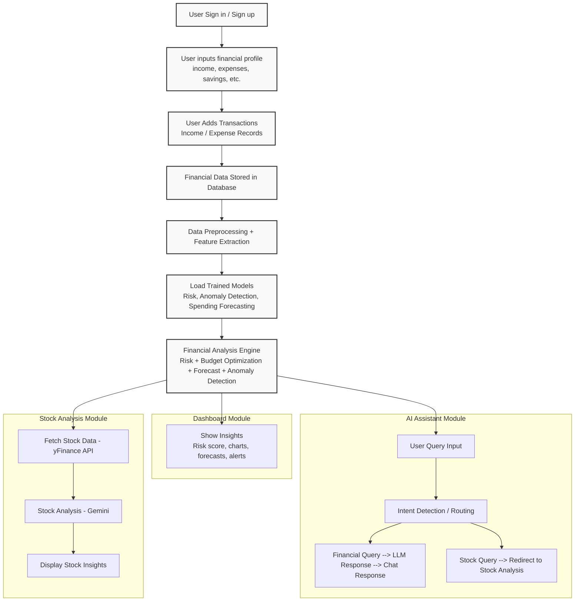
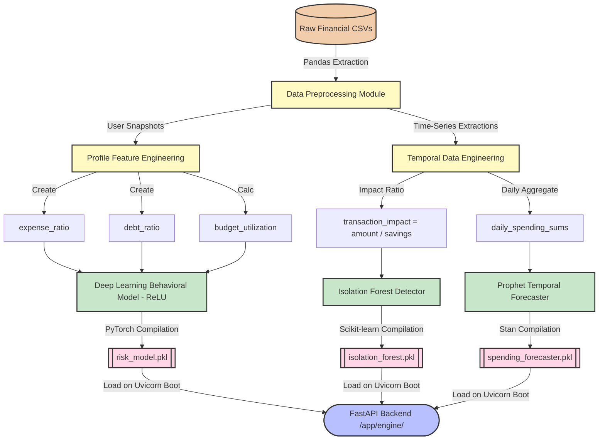

# Advanced System & ML Workflows

This document outlines the detailed architectural workflows powering the AI Financial Advisor platform. Traditional diagrams often miss cross-dependencies (e.g. how the Anomaly detector requires Profile Savings to calculate risk ratios). These updated workflows map exactly how the backend actually breathes.

---

## 1. Complete System Architecture & Data Flow 

This diagram captures the runtime interaction between the Frontend Dashboard, Database, Machine Learning Inference Engines, and External APIs (like Yahoo Finance and Google Gemini).

---

## 2. Machine Learning Training Workflow

This defines how the local Python environment extracts base financial data, executes feature engineering (critical step), retrains the statistical algorithms, and outputs the `.pkl` schema binaries used by the system above.

