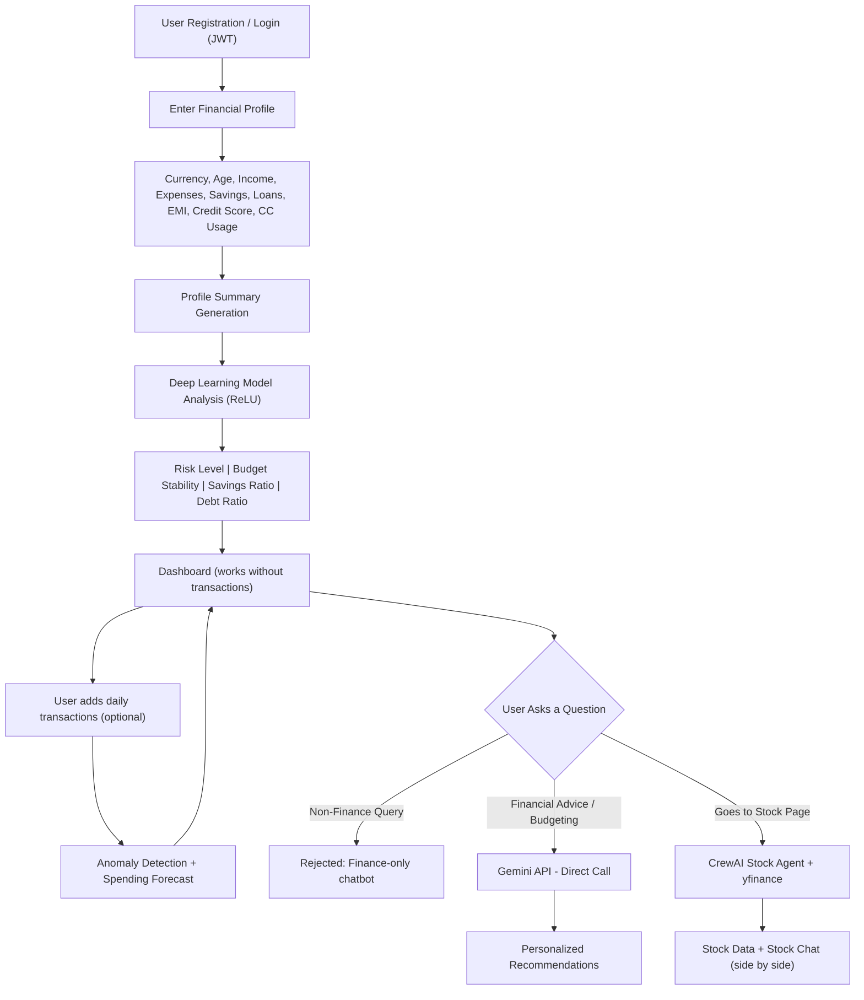

# AI Financial Decision System — Complete Project Analysis

## 1. Problem Statement

**What real-world problem is this project solving?**

Most people lack the financial literacy and analytical tools to manage their money effectively. They struggle with:
- **No visibility** into whether their spending habits are healthy or risky
- **No early warning** when spending becomes abnormal (e.g., sudden 2× jump in food expenses)
- **No personalized guidance** — generic budgeting apps don't factor in your credit score, loans, EMI burden, and savings ratio together
- **No connection between personal finances and investment decisions** — people invest in stocks without understanding whether they can afford the risk

**Why is this problem important?**

Poor financial decisions lead to debt traps, insufficient savings, and failed investments. An AI system that understands a user's *complete* financial profile can provide data-driven, personalized guidance — something that would normally require an expensive financial advisor.

---

## 2. Objective of the Project

Build a **full-stack AI Financial Decision System** that:

1. Collects a user's financial profile (income, expenses, savings, loans, credit score, etc.)
2. **Predicts financial risk** using a deep learning model trained on 100,000+ financial profiles
3. **Detects spending anomalies** automatically using Isolation Forest + Autoencoder
4. **Forecasts future spending** using Gradient Boosting + Prophet
5. **Optimizes budgeting** by suggesting category-level expense reductions
6. **Provides profile-aware stock insights** via a **CrewAI stock agent** with yfinance
7. Routes user queries intelligently — **Gemini API** for financial advice, **CrewAI agent** for stock analysis
8. **Rejects non-financial queries** — the chatbot only answers finance-related questions
9. **Goal-based financial planning** — AI generates monthly savings plans with progress tracking

**Final Goal:** A production-quality web application with a **React.js frontend**, **FastAPI backend**, **JWT authentication**, deep learning models, and a polished dark-themed dashboard.

---

## 3. How the System Works (High-Level Flow)

### Step-by-Step:

| Step | Action | Detail |
|------|--------|--------|
| 1 | **Register / Login** | JWT-based authentication (React → FastAPI) |
| 2 | **Fill Financial Profile** | 9 financial parameters — dashboard works from profile alone |
| 3 | **DL Risk Prediction** | TensorFlow (ReLU) predicts Risk Level, Budget Stability, Savings/Debt Ratio |
| 4 | **Dashboard Loads** | Shows all predictions even **without any transactions** |
| 5 | **Add Transactions** | Optional daily entries — enables anomaly detection + forecast |
| 6 | **Anomaly Detection** | Isolation Forest + Autoencoder flags unusual spending |
| 7 | **Spending Forecast** | XGBoost + Prophet predicts future spending |
| 8 | **AI Chat (Finance-Only)** | Gemini API answers only financial questions — rejects everything else |
| 9 | **Stock Analysis** | Separate page — CrewAI agent shows stock data + chat side by side |

---

## 4. Key Features / Functionalities

| Feature | Description |
|---------|-------------|
| **JWT Auth** | Register/Login with JWT tokens (React + FastAPI) |
| **Financial Profile Dashboard** | Works from profile data alone — no transactions needed |
| **Deep Learning Risk Prediction** | TensorFlow (ReLU activation) classifies risk as Low/Medium/High |
| **Budget Stability Score** | 0-100 score indicating financial health |
| **Spending Anomaly Detection** | Isolation Forest + Autoencoder detect abnormal expenses |
| **Spending Forecast** | Gradient Boosting + Prophet predict future spending trends |
| **AI Budget Optimizer** | Category-level expense reduction suggestions with impact |
| **Investment Capacity** | Safe monthly investment amount after emergency buffer |
| **AI Chat (Finance-Only)** | Gemini-powered, rejects non-finance, no stock in this chat |
| **CrewAI Stock Agent** | Separate page — stock data + stock chat side by side |
| **Goal-Based Planning** | Set savings targets — AI generates monthly plans |
| **Multi-Currency** | INR (₹) and USD ($) with dynamic symbols |

---

## 5. Technologies & Concepts Involved

| Category | Technologies |
|----------|-------------|
| **Frontend** | React.js (Vite), Chart.js, Axios, React Router |
| **Backend** | FastAPI, Uvicorn, Pydantic |
| **Auth** | JWT (python-jose), bcrypt (passlib) |
| **Database** | SQLite3 + SQLAlchemy (ORM) |
| **Deep Learning** | TensorFlow / Keras (ReLU, Autoencoder) |
| **NLP / Chatbot** | Google Gemini API (finance-only) |
| **Stock Agent** | CrewAI (multi-agent) + yfinance |
| **Spending Forecast** | Prophet + XGBoost (Gradient Boosting) |
| **Anomaly Detection** | Isolation Forest (sklearn) + Autoencoder (TF) |
| **Data Processing** | pandas, NumPy, scikit-learn |
| **Dataset** | 100,000+ profiles (real Kaggle + synthetic) |

---

## 6. Type of Solution

This is a **hybrid AI system** combining:

| Type | What It Does |
|------|-------------|
| **Prediction System** | Predicts financial risk level and spending trends |
| **Anomaly Detection System** | Flags abnormal spending automatically |
| **Recommendation System** | Gemini API generates budget optimizations directly |
| **Decision Support System** | CrewAI stock agent provides risk-matched insights |
| **Intelligent Routing** | Finance → Gemini API, Stocks → CrewAI agent, Non-finance → rejected |

---

## 7. Expected Output / Result

### Dashboard Output (works without transactions):
- **Risk Level Badge**: LOW RISK / MEDIUM RISK / HIGH RISK
- **Budget Stability Score**: 0-100 with stability label
- **Savings Ratio**: Percentage with monthly savings amount
- **Debt Ratio**: Percentage with monthly EMI amount
- **Income vs. Expenses Chart**: Bar chart (Chart.js)
- **Expense Category Breakdown**: Donut chart
- **Financial Anomalies**: Flagged categories (after transactions added)
- **Spending Forecast**: Next month + 3 month prediction
- **Budget Optimization**: Actionable suggestions
- **Investment Capacity**: Safe monthly amount

### AI Chat Output (finance-only):
- ✅ "Reducing shopping by 10% could save ₹3,000/month"
- ❌ "What's the weather?" → "I can only answer finance-related questions."

### Stock Analysis Output (separate page):
- Stock data: price, P/E, volatility, market cap, trend
- Stock chat: "TCS is in a downward trend with Medium volatility..."

---

## 8. Real-World Use Cases

| Use Case | Description |
|----------|-------------|
| **Personal Finance Management** | Monthly budgets and savings goals |
| **Loan Applicants** | Debt-to-income ratio analysis |
| **New Investors** | Investment capacity before stock market entry |
| **Financial Advisors** | Quick client profiling tool |
| **Banking Apps** | Embedded financial wellness feature |
| **FinTech Startups** | Core engine for budgeting platforms |

---

## 9. Impact / Value

| Impact | Detail |
|--------|--------|
| **Early Risk Detection** | Know financial risk before it becomes a crisis |
| **Automated Anomaly Alerts** | Catches spending problems automatically |
| **Data-Driven Budgeting** | ML-optimized budget suggestions |
| **Safe Investment Guidance** | Prevents over-investment |
| **Finance-Only AI** | Focused chatbot that doesn't get distracted |
| **Multi-Currency** | Works for INR and USD users |

---

## 10. Possible Improvements

| Improvement | Description |
|-------------|-------------|
| **Real Bank Integration** | Plaid/Open Banking for auto transaction import |
| **Multi-Currency Auto-Detect** | Auto-detect from user's location |
| **Mobile App** | React Native version |
| **Portfolio Optimization** | Modern Portfolio Theory |
| **Seasonal Patterns** | Festival/holiday spending detection |
| **Explainable AI** | SHAP/LIME for risk prediction explanations |
| **Cloud Deployment** | AWS/GCP scalable microservices |

---

## 11. Detailed UI Analysis (From Screenshots)

### Design System
- **Theme**: Dark mode — deep navy/charcoal (`#0a0e1a` → `#1a1e2e`)
- **Cards**: Dark (`#1e2235`) with subtle glowing borders
- **Accents**: Blue (`#4a7dff`) primary, Green (`#22c55e`) positive, Red (`#ef4444`) negative
- **Navbar**: Pill-style buttons, blue active tab, "Finance AI" branding

### Pages:

| Page | Key Elements |
|------|-------------|
| **Login** | Centered card, Login/Register tabs, "Continue" blue button |
| **Dashboard (top)** | Purple gradient welcome banner, badges (Age/Credit Score/Risk), 5 metric cards, Quick Actions |
| **Dashboard (charts)** | Risk Assessment, Income vs Expenses bar chart, Expense Categories donut |
| **Dashboard (bottom)** | Anomalies (⚠️ alerts), Spending Forecast, Budget Optimization, Investment Capacity |
| **Transactions** | Table: Date, Category, Type badge, Amount (green/red), "+ Add New" button |
| **Add Details** | Income/Expenses tabs, category buttons (Shopping, Food, Phone, etc.) |
| **AI Assistant** | Chat bubbles (bot left, user right), finance-only responses |
| **Stock Analysis** | Stock header + price, sub-tabs, Key Stats, AI Agent chat panel (side by side) |
